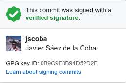

# Documentación Hito 0
Para el hito 0 de IV se pide una serie de items a realizar. En este documento se explica como se han alcanzado.

- [x] Creación de par de claves y subida de clave pública a GitHub.

Este item ya lo tenía preparado de antes, ya que hace tiempo configuré la verificación en dos pasos, la clave GPG y la clave SSH en github.

 
- [x] Configuración correcta del nombre y correo electrónico para que aparezca en los commits correctamente.
- [x] Edición del perfil en GitHub para que aparezca nombre completo y ciudad, así como universidad.

También lo tenía casi completo, a falta de poner Universidad de Granada. Además he añadido una bio al perfil.

 