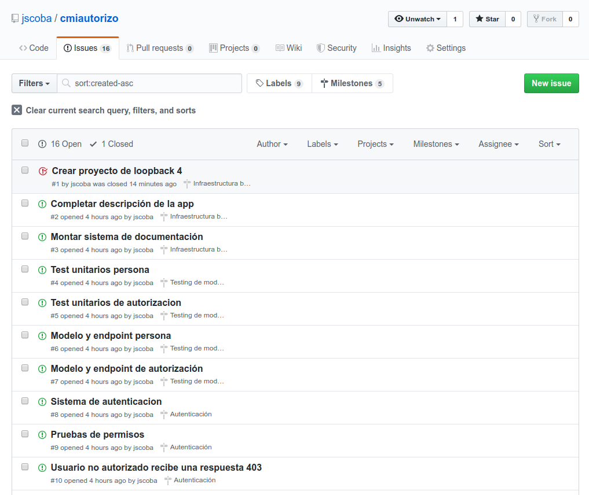

# Documentación Hito 1

Para el hito 1 se pide concretar la documentación y crear hitos e issues en GitHub para seguir las buenas prácticas del desarrollo ágil. En este hito del proyecto se han creado 17 issues y 5 milestones. Todos los commits de este proyecto irán destinados a resolver cada una de las tareas (issues) del proyecto.

El microservicio principal a desarrollar es el backend, servicio que realmente gestiona los datos y ofrece una API REST. El otro microservicio (frontend o interfaz gráfica) se considera "extra" y está dedicado a poder usar el microservicio en un entorno real.

