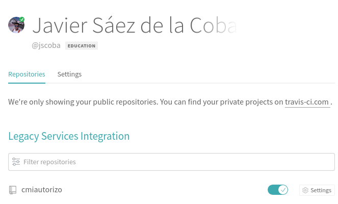
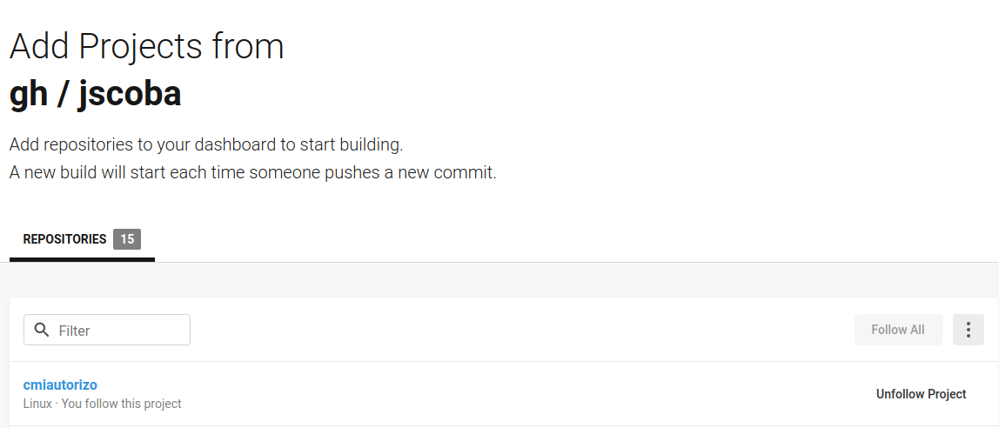
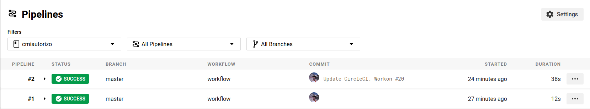
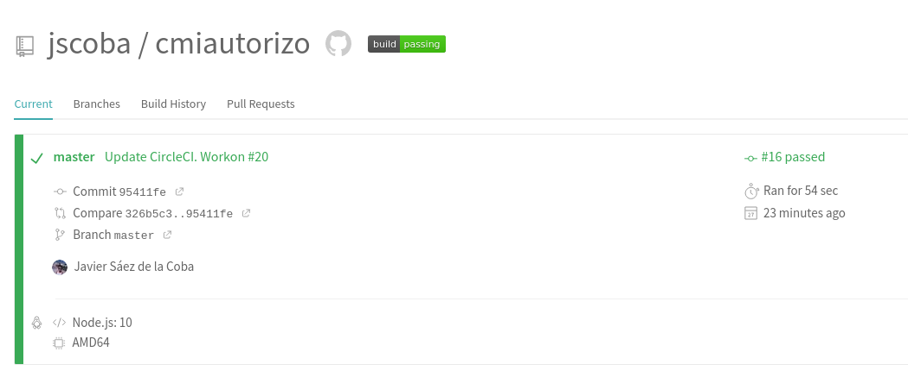
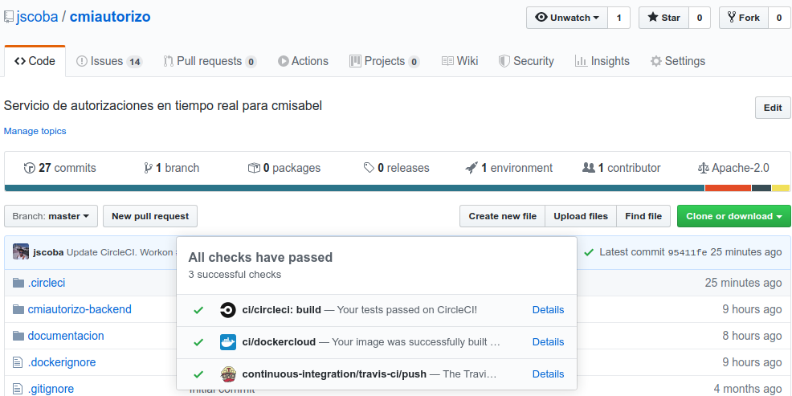

## Integración continua

En este repositorio se ha habilitado Travis-CI como herramienta de integración continua. Para su configuración se ha creado un archivo .travis.yml que incluye la versión del lenguage que estamos usando (dentro de los soportados por la plataforma) así como las tareas a ejecutar para poder testar nuestro proyecto.

Los tests realizados son la ejecución del marco de tests de loopback4 con los tests escritos para nuestro proyecto.
Los test que ejecutamos (actualmente) son:
- Asegurar la respuesta correcta del endpoint de estado.
- Asegurar que no se puede crear un modelo inválido de turno.
- Asegurar que se puede crear un objeto turno.
- Asegurar que se puede conocer el número de turnos de lavadora que hay en el sistema.
- Asegurar que funciona el framework Loopback4 tanto como explorador de api como en forma de ping.

Todos estos tests se encuentran en el directorio `cmiautorio-backend/src/__tests__/`

 Además se ha enlazado Travis con Github de forma que cada vez que haya un push hacia el repositorio se activará de forma automática el proceso de test, avisándonos en caso de que algún test falle.

  Esto es muy importante a la hora de la integración continua futura ya que tenemos que asegurarnos que todo lo que hay en la rama master del repositorio tiene que ser código plenamente funcional, pues será el que se ejecutará en los servidores de "producción" de forma automática.

También hemos configurado el servicio de CI CircleCI. Para ello nos hemos registrado en la plataforma y hemos activado nuestro repositorio de Github.

Hemos añadido el archivo de configuración `.circleci/config.yml` que funciona de una forma muy similar al `.travis.yml`, definiendo la serie de pasos que CircleCI tiene que seguir para construir nuestro proyecto y correr los tests de npm.

Una vez que hacemos push ya podemos ver que en ambas plataformas se generan trabajos que comprueban que los tests pasan.

