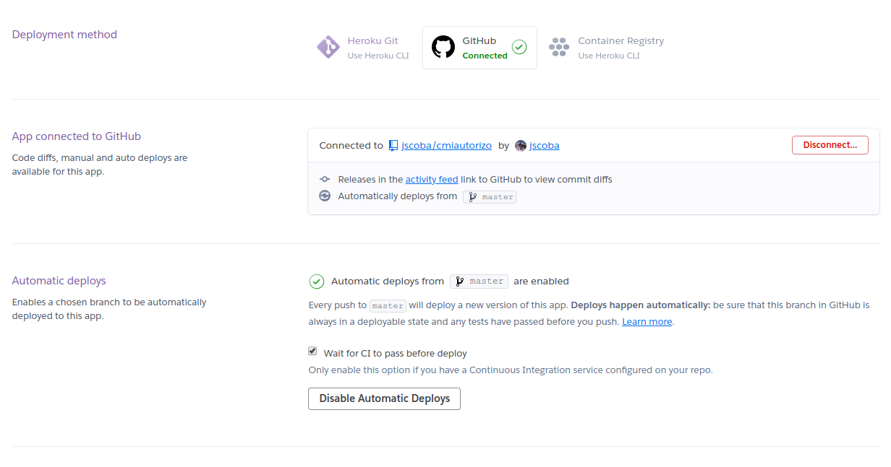

# Despliegue de la aplicación en Heroku

A la hora de elegir un PaaS tras ver varias opciones como Google App Engine que no me convencían lo suficiente opté por Heroku.

Para poder desplegar la aplicación sin contaneirizar se creó un archivo Procfile en la raiz del repositorio donde se indica la orden a ejecutar de nuestra herramienta gestora de tareas (npm) usada para arrancar la aplicación.

Además al estar el código de la aplicación en una carpeta que no es la raiz del repositorio se ha hecho necesario crear un nuevo package.json en la raiz que cambia de directorio en heroku antes de crear la imagen en la nube e instala las dependencias necesarias desde el package.json de nuestra aplicación (el de verdad, el que está dentro de cmiautorizo-backend).

Una vez estaban ambos archivos creados desde el cli de Heroku se ejecutaron los siguientes comandos:
```bash
heroku apps:create cmiautorizo-backend # Crear la aplicación en nuestra cuenta de Heroku
git push heroku master # Subir el repositorio a Heroku para crear la imagen de la aplicación
```

Tras ejecutar estos comandos ya estaba funcionando la aplicación sobre la Plataforma de Heroku

Además desde la interfaz web de Heroku hemos configurado que se haga un nuevo deploy de la aplicación cuando se haga una actualización de la rama `master` del repositorio en GitHub y hayan pasado los tests de Travis

