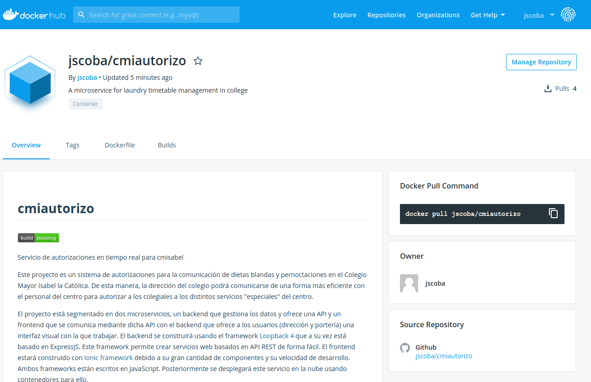
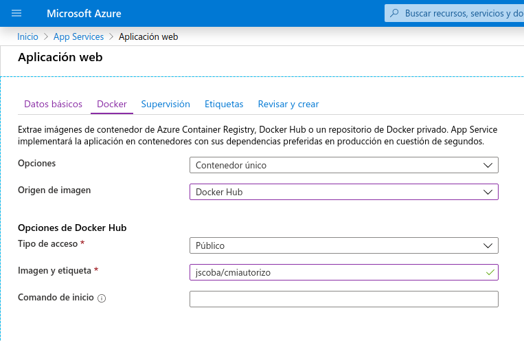
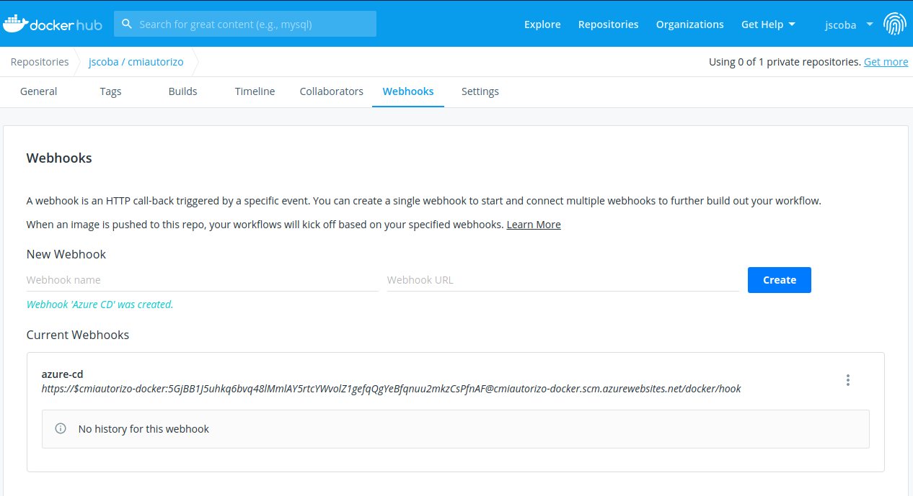

# Documentación del hito 5 de IV

En este hito se nos pide contaneirizar la aplicación, es decir, convertirla en una imagen de Docker y subirla al Docker Hub así como desplegarla.

Para poder crear una imagen de Docker primero necesitamos un fichero Dockerfile que contenga los pasos para poder generar la imagen.

Basándonos en los ejemplos que hay en la documentación oficial de [Loopback4](https://loopback.io/) sobre Dockerfiles para aplicaciones creadas usando este framework creamos rápidamente el fichero Dockerfile de la raiz de nuestro repositorio con su correspondiente fichero .dockerignore para evitar copiar las dependencias de node en la imagen (queremos que la imagen sea lo más ligera posible para que sea rápida de descargar del repositorio de imágenes).
Una vez tenemos el fichero de configuración de docker podemos comprobar que todo es correcto ejecutando:
```bash
docker build --tag cmiautorizo .
```
desde la raiz de nuestro repo. Esta orden crea la imagen docker en local y la guarda en nuestro repositorio privado de imágenes.

Ahora vamos a subirla al Docker Hub para que cualquiera pueda descargársela de allí y ejecutar la aplicación directamente. Para ello nos registramos en Docker Hub y creamos un nuevo repositorio.

Aquí tenemos ahora dos posibilidades: subir manualmente la imagen creada desde el ordenador local o activar los **autobuilds** para que Docker Hub automáticamente reconstruya la imagen cada vez que hacemos un commit a la rama master de nuestro repositorio.

Esta es la opción que he elegido. Al activar los autobuilds tarda un poco en generar la imagen (unos 10 minutos) pero una vez lista ya podemos descargar esta imagen de docker ejecutando directamente `docker pull jscoba/cmiautorizo`



Para poder desplegar este contenedor se ha usado el servicio *App Service* de Microsoft Azure. Para ello se ha creado un nuevo servicio usando el tier gratuito y se ha configurado para que se descargue la imagen del Docker Hub. Una vez hecho esto la aplicación ya está corriendo en la nube de Azure. Además se activa la integración contínua a través de un WebHook en Docker Hub para que al actualizar la imagen se actualize también la del servicio que está corriendo.



